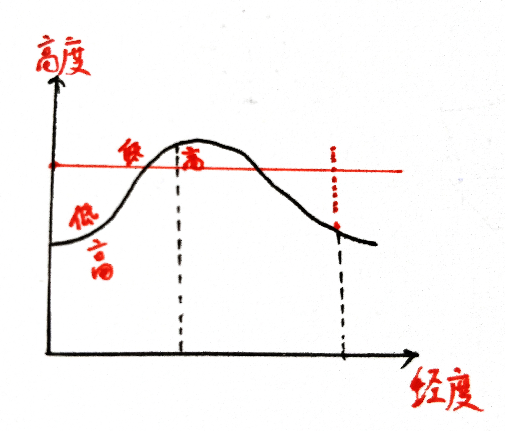

地理
====

一模9、10、11
-------------

左边这幅图我以前没见过，但是各种“等值线”图都是差不多的。一般的等温线图都是画在常见的地图上，两个坐标方向一个是经度一个是纬度。这幅“等温线分布高度图”比较奇特，两个方向一个是经度一个是高度——相当于把地球切开了看。

等温线图上最基本的问题就是比较温度高低，这就和等高线图一样。首先要明白整体的地势/温度趋势方向——如果有多条等温线的话，自然很容易判断；如果只有一条，就要从温度的影响因素上考虑。越往两极越冷，越往高处越冷。这一题就是考虑高度的影响。

1. 看左图，等温线中部隆起，也就是说同一高度中部温度大于两侧。第一问选A。 

2. 对第二问我有点疑问，乙是指空中的那个点还是下面的地面？我这里当作空中。大气的保温/削弱效果主要取决于大气厚度，如果考虑日变化的话主要取决于天气。甲、乙两地……我认为大气条件差别不大，因为乙是空中的点，跟甲的海拔一样，保温/削弱应该相同（这跟你们老师的解释不一样，请按老师为准）。D的气温垂直递减率我不清楚，但是C还是比较明确的。地面、海洋都有吸收阳光储存热量的能力，在夏天，地面的温度一般都高于气温，这是常识。事实上，空气很少吸收阳光，基本上是被地面和海洋加热的。所以越靠近地面，温度越高，甲温度高就是因为靠近地面，吸收辐射多。

   .. note:: 从物理的角度解释地面温度较高的原因：稀薄的空气对阳光的吸收率极低，而固态的地面可以吸收所有阳光，再以长波辐射的形式释放能量。空气对长波辐射的吸收率高，因而受地面加热。

3. 我认为选A。海拔高，能适应的植被应该减少，感觉D是不对的。对于雪线和林线不太了解，在我的印象中二者大致平行……温度越高，雪线越高，林线也越高，那么根据左图，应该是选A。具体请你再去问问老师┑(￣Д ￣)┍